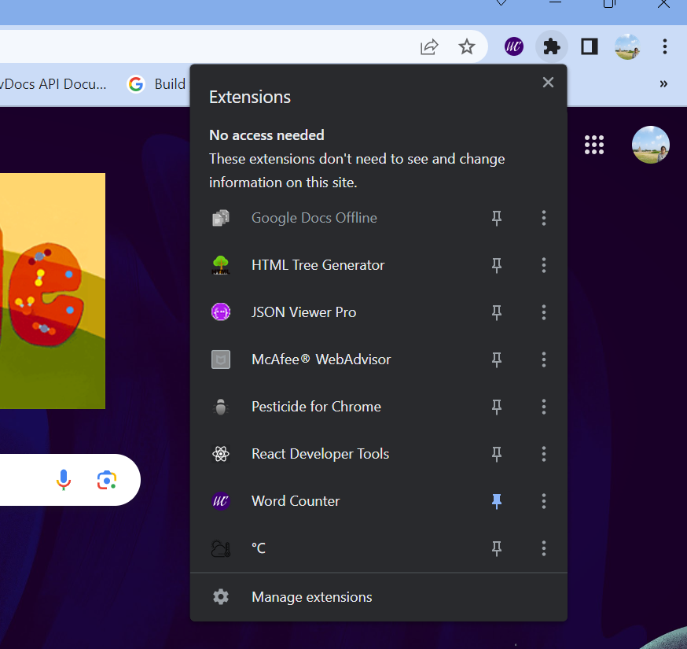
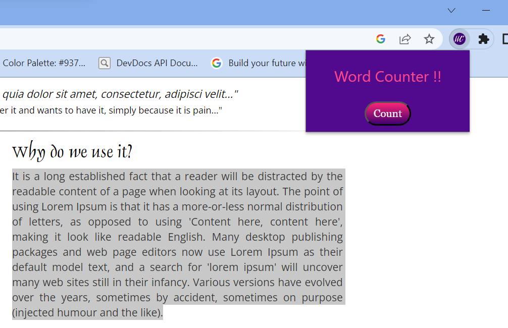
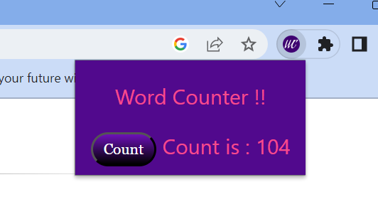

# WordCount - A Chrome Extension

Did you ever had the need to count your essays or para? This extension does the exact same thing.

## How to use this?

This is pretty simple to use.

Pin the extension to your browser.

Now, select the text to be counted.
Click on the extension and then 'Count'.

And there it is, the word count of the selected text.

